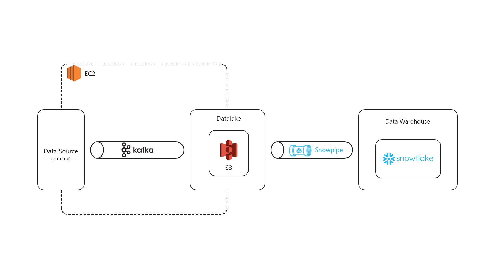

# Build Stream Pipeline for Stock Analysis
This repository contain my project about building streaming pipeline to ingest stock data into data lake (AWS S3), after that move the data automatically using snowpipe and load it into data waerhouse (Snowflake).

## Architecture


## Run locally
- Clone the project.

    ```bash
    git clone https://github.com/ArkanNibrastama/stream-pipeline-stock-analytics
    ```
- Install all the dependencies.
    ```bash
    pip install -r requirements.txt
    ```
- Set up the Snowflake and snowpipe (you can find the full explanation in the last section).
- Fill the blank variable with your own data
    <br>example:
    ```python
    API_KEY = "{/YOUR API KEY}"
    AWS_ACCESS_KEY = "{/YOUR ACCESS KEY}"
    AWS_ACCESS_SECRET_KEY = "{/YOUR SECRET ACCESS KEY}"
    ```
- Run the producer
    ```bash
    python producer.py
    ```
- Run the consumer
    ```bash
    python consumer.py
    ```

## Full explanation
To make better understand of this repository, you can check my linkedin post about this project [Build Real-time Stock Analytics Data Pipeline](https://www.linkedin.com/feed/update/urn:li:activity:7020607156605390848/).
